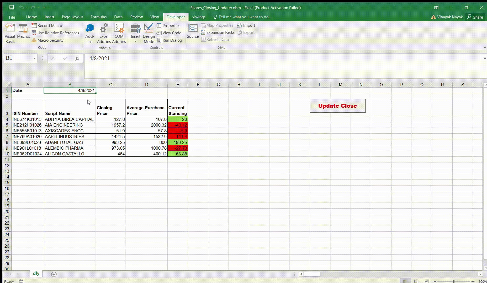

# Python Excel Automation

It is possible to use python now in your excel workflows.

This allows the use of many open-source libraries to be used in your workbooks to automate your tasks and enhance productivity. `xlwings` allows you to do such an integration and link python code with VBA macros to give tremendous functionality.

This repo aims to demonstrate how the same could be achieved and [this post](https://nayakvinayak95.medium.com/python-makes-spreadsheets-excellent-f48ce0c648e3) describes the project in more detail. At the end, you should be able to see something like this in action:

